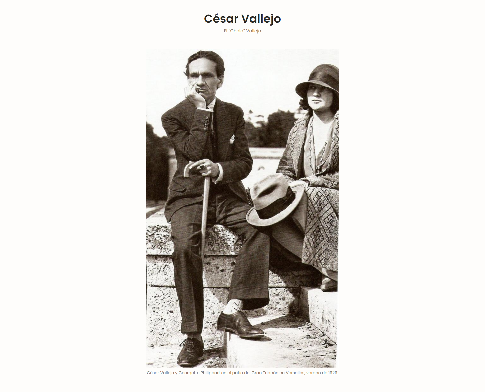
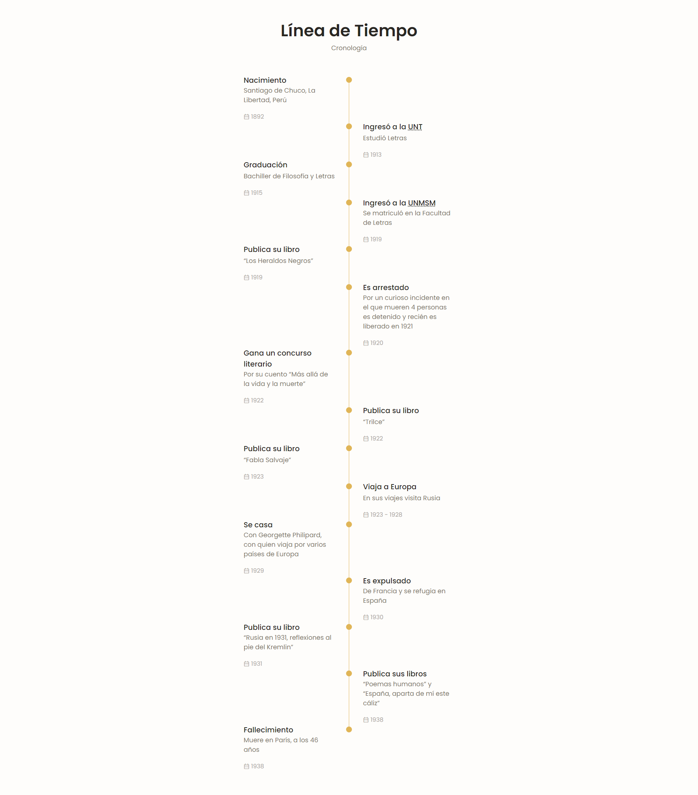
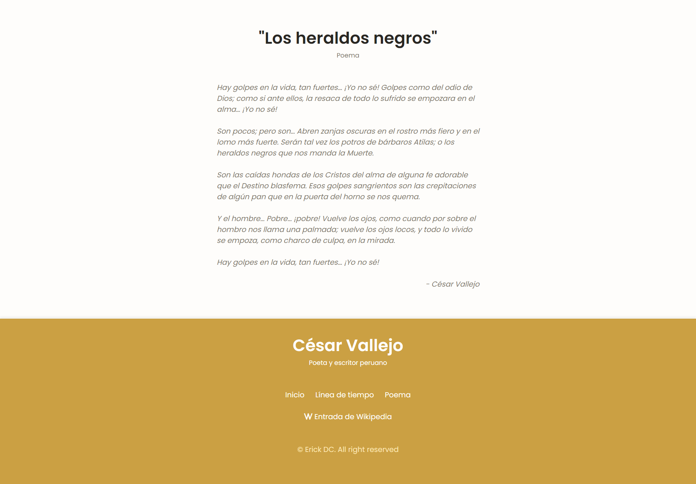

# Cesar Vallejo Tribute
Página web tributo al poeta y escritor peruano César Vallejo.

## Tecnologías
Esta página web fue realizada con las siguientes tecnologías:
- HTML5
- CSS3
- JavaScript

## Secciones
Esta página web contiene 3 secciones: **Inicio**, **Línea de tiempo** y **Poema "Los heraldos negros"**.

### Inicio
#### En esta sección verás una imagen del poeta y escritor peruano César Vallejo junto a su esposa Georgette Philippart. 

### Línea de tiempo
#### En esta sección está la línea de tiempo que explica cronológicamente los acontecimientos que han ocurrido a lo largo de la vida de César Vallejo.

### Poema "Los heraldos negros"
#### En esta sección hay un poema muy reconocido de César Vallejo llamado "Los heraldos negros".

